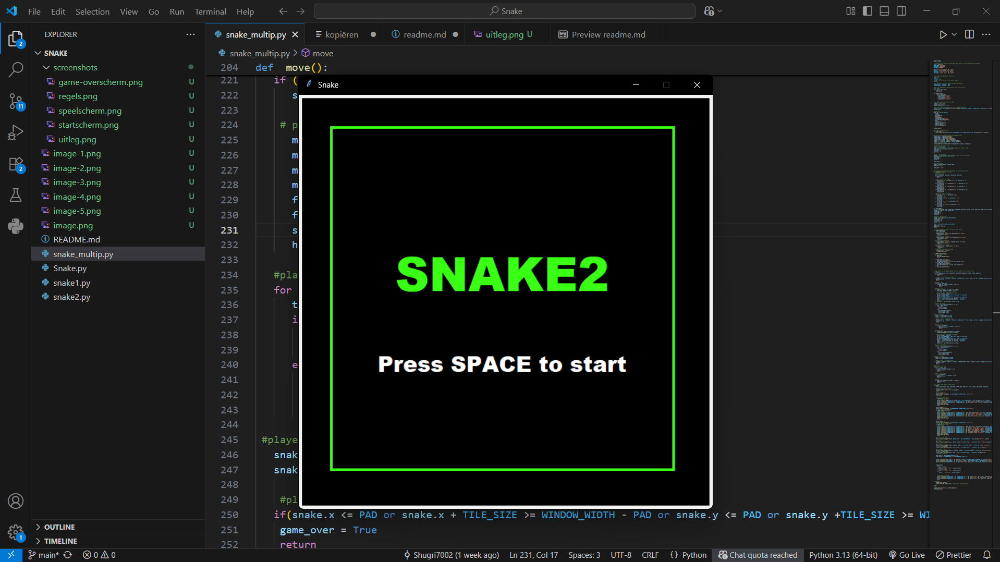
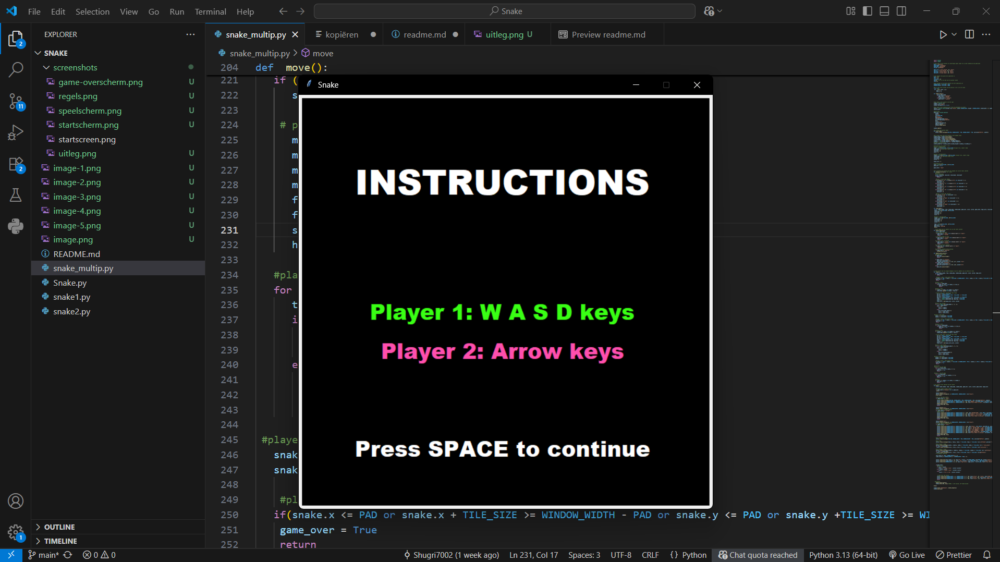
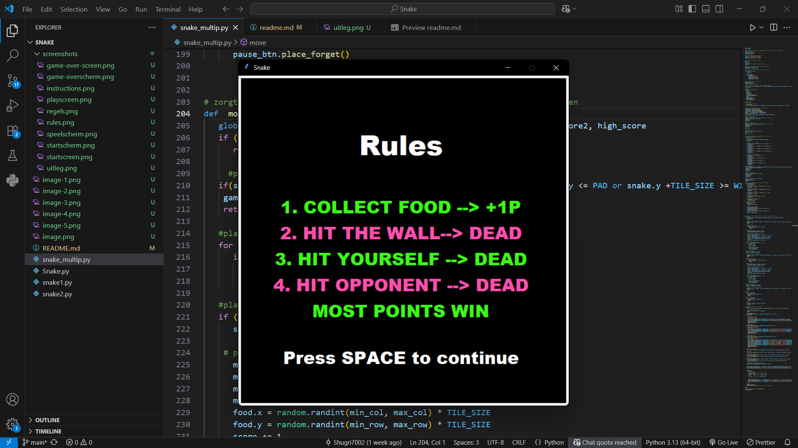
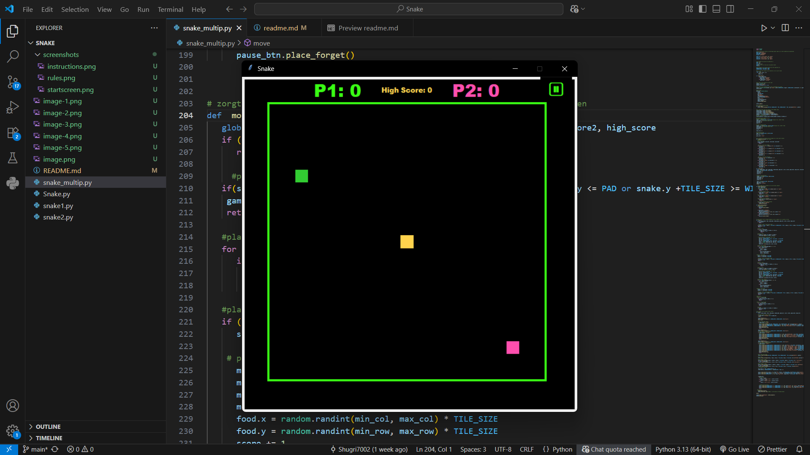
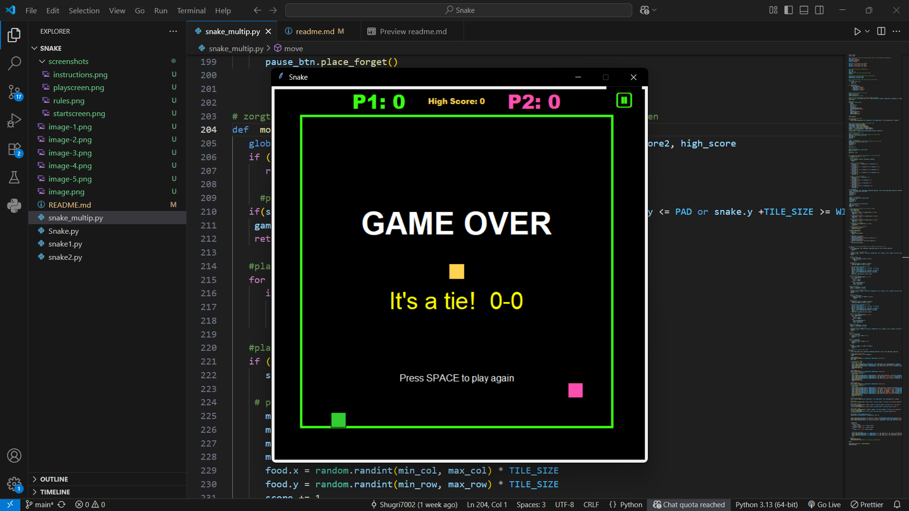

# SNAKE2

## Description
This is a **multiplayer Snake Game** built with **Python (Tkinter)**.  
The goal is simple: collect food, grow your snake, and score points.  
Be careful not to hit the walls, yourself, or the other player.

## Installation
1. Make sure **Python 3.13.7** with [Tkinter](https://docs.python.org/3/library/tkinter.html) is installed.  
2. Clone the repository:  

   ```bash
   git clone https://github.com/Shugri7002/Snake.git
   cd Snake

3. Run the game:  

   ```bash
   python snake_multip.py

## Controls
- Player 1 (Green): **W, A, S, D**  
- Player 2 (Pink): **Arrow keys**  
- Pause/Resume: **button in the top right corner**

## Rules
1. Collect food to score points (+1 per item).  
2. Hit the wall? → Game over.  
3. Run into yourself? → Game over.  
4. Hit the other player? → Game over.  
5. The player with the highest score wins.  

## Screenshots

### Start screen
1. 

### Instructions
2. 

### Rules
3. 

### Gameplay
4. 

### Game Over screen
5. 

## Author
Shugri Farah, Class Oranje, 25-9-2025
